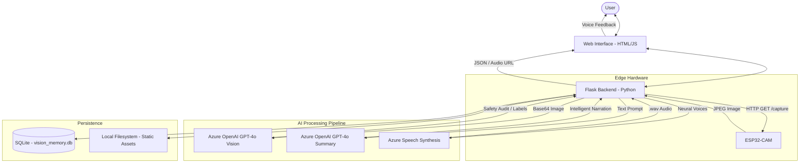

# 👁️ Blindur - Vision AI Pro

Blindur is an advanced assistive technology project designed for the ImagineCup. It combines edge computing (ESP32-CAM) with cutting-edge Cloud AI (Azure OpenAI & Speech) to provide real-time environmental awareness and hazard detection for people with visual impairments.

## 🏗️ Architecture

## 🚀 Key Features

- **Real-time Hazard Detection**: Identifies environmental risks like stairs, sharp edges, and obstacles.
- **Intelligent Scene Summarization**: Provides a concise, human-like description of the environment.
- **Interactive Q&A**: Allows users to ask specific questions about the captured scene.
- **Persistent Memory**: Stores history of captures for later review.
- **Multimodal Feedback**: Visual UI combined with neural text-to-speech.

## 🛠️ Tech Stack

- **Hardware**: ESP32-CAM
- **Backend**: Python, Flask
- **AI/ML**: 
  - Azure OpenAI (GPT-4o Vision)
  - Azure Speech Services
  - YOLOv8 (Integrated for hybrid detection)
- **Database**: SQLite
- **Frontend**: HTML5, CSS3, JavaScript (Vanilla)

## 📦 Installation & Setup

1. **Hardware**: Flash the ESP32-CAM with the code in `arduino_code/blindur/`.
2. **Environment**:
   - Install dependencies: `pip install -r requirements.txt` (or use `uv`)
   - Create a `.env` file with your Azure credentials.
3. **Run**: `python app.py`

---
*Developed for ImagineCup 2026*
